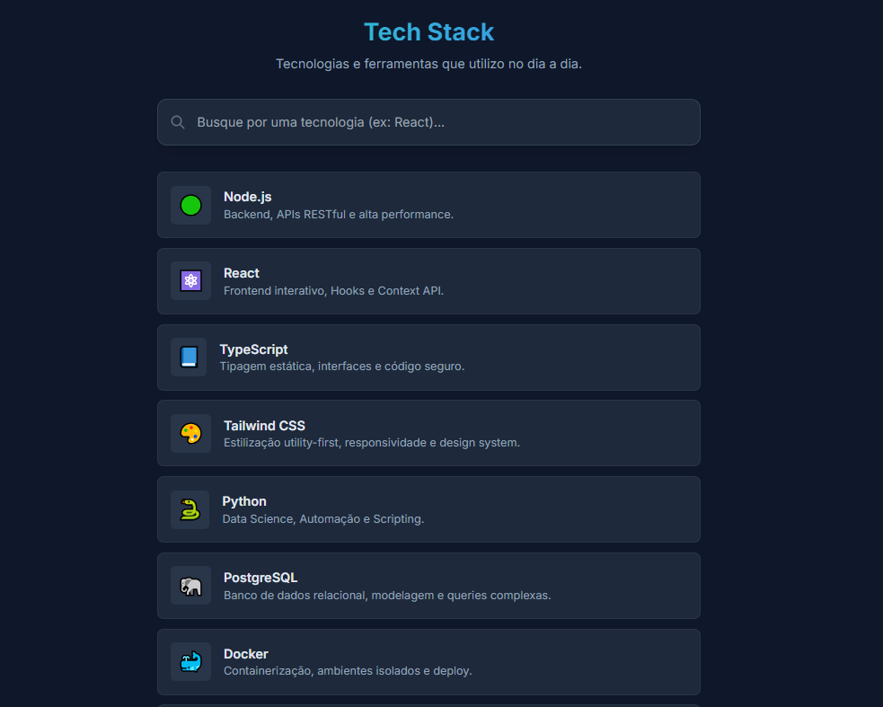

# 🔍 Tech Stack Live Search

> Uma interface de busca reativa e elegante desenvolvida para filtrar tecnologias em tempo real.




## 💻 Sobre o Projeto

Este projeto foi desenvolvido como parte de um desafio técnico de Frontend. O objetivo principal foi criar um mecanismo de busca **instantâneo** (Live Search) que filtra uma lista de itens baseada na entrada do usuário, sem a necessidade de recarregar a página ou fazer requisições extras ao servidor.


### 🎯 Requisitos Cumpridos
- [x] Lista com no mínimo 10 itens (Tecnologias/Skills).
- [x] Filtragem em tempo real utilizando `textContent.includes()`.
- [x] Ocultação automática de itens não correspondentes via manipulação de classes CSS.
- [x] Interface Responsiva e "Dark Mode" nativo.

## 🛠 Tecnologias Utilizadas

* **HTML5 Semântico**: Estrutura acessível e organizada.
* **Tailwind CSS (via CDN)**: Para estilização rápida, responsiva e moderna, sem necessidade de *build steps* complexos.
* **Vanilla JavaScript**: Lógica de filtragem leve e performática.

## 🚀 Como funciona a Lógica

A busca foi implementada focando em simplicidade e performance. O script captura o evento `input` do usuário e varre o DOM.

```javascript
// Exemplo simplificado da lógica implementada
searchInput.addEventListener('input', (event) => {
    const term = event.target.value.toLowerCase();
    
    listItems.forEach(item => {
        // Busca no conteúdo textual completo do card (Título + Descrição + Emoji)
        const text = item.textContent.toLowerCase();
        
        // Toggle da visibilidade
        if (text.includes(term)) {
            item.classList.remove('hidden');
        } else {
            item.classList.add('hidden');
        }
    });
});
```
## 📂 Estrutura de Arquivos

A estrutura foi pensada para projetos estáticos, mantendo a raiz limpa e os recursos organizados:

/busca_lista_beneficios

    │
    ├── assets/              <-- Pasta principal de recursos
    │   ├── js/              <-- Pasta específica para Scripts
    │   │   └── script.js
    │   │
    │   │
    │   └── img/ 
    |        └── image.png     
    │
    ├── index.html           
    └── README.md         <-- Documentação

## 🚀 Como executar

1. Clone este repositório:
   ```bash
   git clone https://github.com/Alicia-Alexia/busca_lista_beneficios

2. Abra o arquivo index.html em qualquer navegador  


## 🤝 Autor
Desenvolvido por Alicia como parte de estudos em Frontend Development.